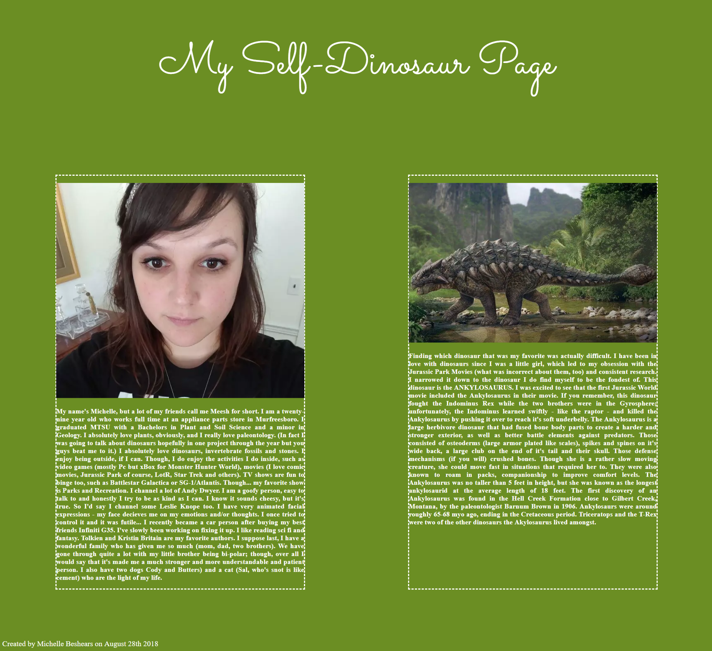

# Dino Page

This particular project was to test and practice my CSS and HTML skills. This project was to show us that we could accomplish creating two different cards without JS. It also was a short description of ourselves to help our professors get to know us, and of course, to show what our favorite dinosaur was. Education on dinosaurs is important. Period. 

# Screen Shot:



# How To Run This Project! 

1. If you do not have a server installed, this is your first step: 
```
npm install -g http-server
```
That ^ will be done in your terminal. 

2. Run the server: 
```
hs -p 9999
```
3. Open Chrome to nagivate the page and have fun! 
```
localhost:9999
```
